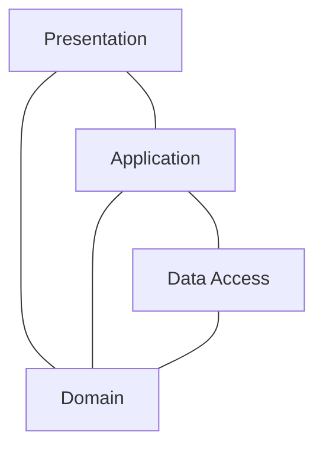

# NodeJS Layered App

This repository is a working example of a layered API application implemented in NodeJS, my focus here is to demonstrate the advantages and disadvantages of this approach, walking the reader through each layer and explaining the rationale behind each design decision.
The project itself is a todo-list app, but it was built to be production-ready and with scalability in mind. The goal is to make it as closer to a real application as possible.

## Project structure

The project is structured in the following way:

Each layer depends on one or more layers below it, but never on a layer above it.
As you can guess, dependency management between layers is a crucial point to keep the implementation clean, that is why a dependency injection strategy was implemented, allowing parts of each layer to explicitly tell what dependencies it has. These dependencies are resolved in the bootstrap phase of the application.

You can find detailed documentation for each of these layers here:

- [Presentation](src/presentation/README.md)
- [Application](src/application/README.md)
- [Data Access](src/data-access/README.md)
- [Domain](src/domain/README.md)

## High level overview

The idea behind a layered application is to have multiple logical building blocks, each of them with a set of responsibilities that allows the other ones to function properly. For instance, the goal of the presentation layer is to be the first point of contact for the callers of the API, rejecting unauthorized or malformed requests quickly and effectively, whilst the goal of the application layer is to hold critical application logic to keep the whole application consistent.

## Testing strategy

There are three types of tests in this application, each of them described and detailed below:

- Unit tests: cover the functionality of a class or function in isolation, mocking and stubbing its dependencies when needed
- Acceptance tests: make sure the entire application is working, from the entry points (express route definitions) all the way down to the database communication (stubbed using an in-memory database to make tests faster and more independent of database state)
