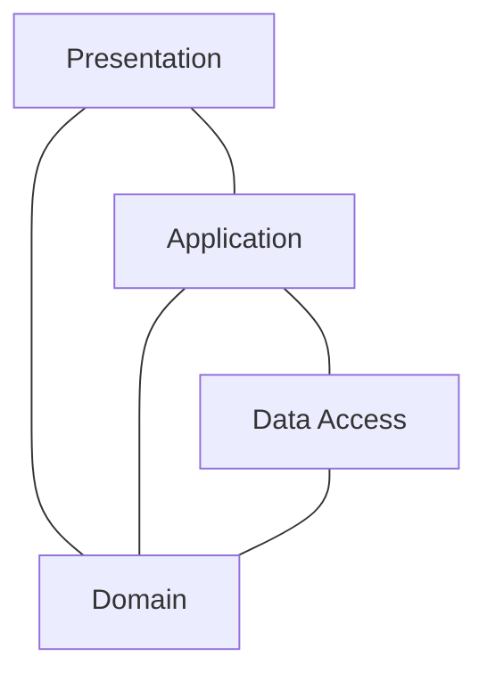

[](https://github.com/kaiosilveira/nodejs-layered-app/actions/workflows/ci.yml)
[](https://codecov.io/gh/kaiosilveira/nodejs-layered-app)

**ℹ️ _NOTE TO FUTURE READERS: Due to new learnings, specially from "Domain-Driven Design" (Evans 2003) and "Strategic Monoliths and Microservices" (Vernon & Jaskula 2022), this implementation no longer reflect my opinion on how to design modular software systems. Although some of the building blocks described in DDD are present here, I now see that some of the choices I made do not yield good design properties in the mid to long-term, specially when it comes to flexibility and isolation. Nevertheless, what's presented here, in my opinion, is still a good try and worth the reading._**

# NodeJS Layered App

This repository is a working example of a layered API application implemented in NodeJS, its focus is to demonstrate the advantages and disadvantages of this approach, walking the reader through each layer and explaining the rationale behind each design decision.
The project itself is a todo-list app, but it was built to be production-ready and with scalability in mind. The goal is to make it as closer to a real application as possible.
Note: The structure implemented and explained here is by no means a framework. Feel free to use it as a starting point and make any changes needed to make it work for you.

## Project structure

The project is structured in the following way:



Each layer depends on one or more layers below it, but never on a layer above it.
As you can guess, dependency management between layers is a crucial point to keep the implementation clean, that is why a [dependency injection](#dependency-injection) strategy was implemented, allowing parts of each layer to explicitly tell what dependencies it has. These dependencies are resolved in the bootstrap phase of the application.

You can find detailed documentation for each of these layers here:

- [Presentation](src/presentation/README.md)
- [Application](src/application/README.md)
- [Data Access](src/data-access/README.md)
- [Domain](src/domain/README.md)

## High level overview

The idea behind a layered application is to have multiple logical building blocks, each of them with a set of responsibilities that allows the other ones to function properly. For instance, the goal of the presentation layer is to be the first point of contact for the callers of the API, rejecting unauthorized or malformed requests quickly and effectively, whilst the goal of the application layer is to hold critical application logic to keep the whole application consistent.

## Directory structure

```bash
├── domain
├── data-access
├── application
├── presentation
├── app.js
└── app.test.js
```

## Testing strategy

There are two types of tests in this application, each of them described and detailed below:

- Unit tests: cover the functionality of a class or function in isolation, mocking and stubbing its dependencies when needed
- Acceptance tests: make sure the entire application is working, from the entry points (express route definitions) all the way down to the database communication (stubbed using an in-memory database to make tests faster and more independent of database state)

## Environment

Currently, the following environment variables are needed:

```
PORT=<app_port>
ENCRYPTION_KEY='<ENCRYPTION_KEY>'
JWT_SIGNING_KEY='<JWT_SIGNING_KEY>'
DB_HOST='<localhost>'
DB_NAME='<db_name>'
DB_PROTOCOL='<db_protocol>'
DB_PORT=<db_port>
```

## Global application config

As the application relies heavily on passing dependencies to classes and functions to isolate as much as possible the utilisation of external resources, thus keeping the unit tests simple and enabling a high level of test coverage, a global shared config needs to be passed in to the main `ExpressAppFactory` at bootstrap time. This config should contain environment information and the external libraries needed by the downstream components, in the various layers. This configuration is passed forward in a "self-service" way, where each layer extracts what it needs to make their classes and functions work.

## Dependency injection

In order to keep the instantiation of resources as clean as possible and to avoid repetitive work instantiating numerous dependencies for each layer, a dependency injection system was put in place. This system works by defining an `$inject` field on the class that wants to have dependencies injected automatically and defining a `$tag` field on each class that is eligible for injection. To give an example, imagine that we have a controller at the presentation layer called `MyController`. This controller needs a service called `MyService` to work. We can make this dependency explicit by passing `MyService`'s tag to the correct place in the `MyController` dependency structure, like this:

```javascript
// application layer
class MyService {}
MyService.$tag = 'myService';

// presentation layer
class MyController {}

MyController.$inject = { applicationLayer: { services: { myService: MyService.$tag } } };
```

Then, to instantiate `MyController`, we could simply call an utility function called `instantiated`, that will resolve all dependencies and return a working instance of `MyController`:

```javascript
export default config => {
  return {
    path: 'myResource',
    router: createRouter({
      expressRouterInstance: config.libs.express.Router(),
      controller: instantiated(MyController, config),
    }),
  };
};
```

The `instantiated` function rely on a static factory that knows how to build a `MyController` and also knows how to delegate the instantiation of resources from other layers to their corresponding static factories. By design, each layer will contain a factory that knows how to build the whole layer. In cases where there are multiple groups of classes in a layer, the static layer factory can delegate to subfactories within the same layer, e.g., in the application layer there is `ApplicationLayerFactory`, which delegates the instantiation of the application services to `ApplicationServiceFactory`.

## Virtualization and containerization

This app uses docker to create a container of the application. This container should receive at creation time the environment variables needed by the application in order for it to work properly.

## Twelve-factor app compliant

This application is compliant with the ["twelve-factor app"](https://12factor.net/) definitions. Each topic is covered and explained below:

**I. Codebase — One codebase tracked in revision control, many deploys**

This app is tracked in version control using git + GitHub

**II. Dependencies — Explicitly declare and isolate dependencies**

We're using `package.json` for dependency declaration and `yarn` as the package manager for dependency isolation. Furthermore, we're isolating dependencies at application level through the top-level global config. [See Global application config](#global-application-config)

**III. Config — Store config in the environment**

All environment variables are external from the application and are mapped at bootstrapping time to a global `env` variable, shared across the whole app. This separation makes it easy for deploying across environments, allowing for continuous integration and delivery

**IV. Backing services — Treat backing services as attached resources**

The application structure allows for treating all backing services as attached resources in a way that all configuration for accessing those resources are abstracted away from code (through environment variables, as for the previous topic above) and the code itself contains specific classes to abstract the communication with the external resources and providing an uniform way of using these resources from inside the app. Should we need to change a connection, we just have to change the environment variables and perform a new deploy. Should we need to add a new database (let's say, a memory database), we can do this the same way, creating a class to abstract the connection, one for communication, and then providing it to the whole app. Currently, for the mongo database we're using, there's a `dbConn` variable configured to hold the long-living connection to MongoDB, this connection is provided to all internal resources.

**V. Build, release, run — Strictly separate build and run stages**

The deploy pipeline was left out of this example as its not intended to be deployed to any environment and serve only as a reference. Production versions based on this example's structure were implemented using GitHub Actions + AWS ECS (Elastic Container Service) to provide Continous Delivery. The stages of the pipeline were the following:

- creating a docker image of the application, bounded to its external configuration (through env vars)
- pushing the image to the AWS ECR (Elastic Container Registry)
- fetching the AWS ECS' task definition
- updating the task definition to point to the new container image created in the steps above
- pushing this task definition back to ECS
- updating the service running the task definition to switch to the new version

The rollback strategy would be simply changing the task definition back to the previous version

**VI. Processes — Execute the app as one or more stateless processes**

This application and its corresponding production implementations does not rely on any long-lived, in-memory information. All backing services are external to the process, making it stateless, replicable and clusterable. Should we need any in-memory information, this should also be external and served as an attached resource (a Redis database hosted in AWS Elasticache, for instance).

**VII. Port binding — Export services via port binding**

Port binding is done at build (for non-dev) time via the Dockerfile, which exposes a port for the app to listen to. This port is passed in as an env var to the app.

**VIII. Concurrency — Scale out via the process model**

From a high level point of view and considering that we want to use the deployment strategy described at "Build, release, run", we can consider the task running inside AWS ECS as our "process". This process is in fact a Docker process running our container inside a EC2 instance. Process monitoring is done by AWS ecs-agent and should one process fail, it would spin up a new one quickly.

**IX. Disposability — Maximize robustness with fast startup and graceful shutdown**

Considering the previous topics above around deployment strategy, startup should be as fast as starting a new task at ECS. Shutdown is ready to destroy, detach and disconnect resources using the `die` function defined at the root file.

**X. Dev/prod parity — Keep development, staging, and production as similar as possible**

Production implementations of this app had their environments similar to product as per-design / per-deploy stategy, as we were deploying to ECS, we were exercising the (single) deploy script in every deploy (as the Continous Delivery book strongly recommends). We strongly recommend to do the same to avoid unexpected and subtle differences between environments.

**XI. Logs — Treat logs as event streams**

We're using `winston` as our logging tool. Currently it's set up to use a simple `Console` transport, that basically print's to `stdout`. Production versions of this app usually uses the option to write the output to Cloudwatch when configuring the task definition in AWS. The well-structured format that `winston` provides allows for easy aggregation / querying (using Cloudwatch Insights) of the outputs. Alternativelly, some versions of this app structure are implementing a custom `CloudwatchTransport` and attaching it to `winston`, so the logs are written to Cloudwatch without relying on the changes in the task definition (although this could be considered a violation of this factor altogether, as the app would be aware of the logging strategy).

**XII. Admin processes — Run admin/management tasks as one-off processes**

This example application has no registered tasks at the moment, but should it need it, we could probably keep them all under a `/tasks` directory, then we could load the files needed to perform the task at hand and run it via the `scripts` section in the `package.json` file.

## Real-world considerations and tweaks

Spread across the documentation we could notice that some tweaks were needed in order to make this structure usable in production. Some others were not menitoned, but worth noticing.

Noticeably, unit tests could become really verbose to implement, considering the overhead that the dependency injection system brings to the system. This was addressed in real-world implementations of this example by a `DependencyBuilder`: a fluent implementation of the builder pattern. This builder is responsible to provide methods like `addApplicationService` and `addRepository` and to create the final structure using these given resources, so the engineers would not need to mind the whole dependency tree.

Another improvement was to create assertion functions to verify the results, abstracting the overhead of destructing the properties of the response (commonly `payload` + `meta` at the presentation layer and `status` and `body` at the presentation layer), these functions look like `assertControllerFailedWithInternalServerErrorAnd()` and `assertControllerSucceedsWithCreatedAnd()`, this saves some lines of code, makes the readability of the tests way better and makes the implementation of unit tests way less tedious.

## Conclusions and next steps

As demonstrated, this structure could deliver good results to small and medium-size NodeJS applications, where "size" here is used both to refer to the amount of files + lines of code and to team size, and the explanation for both of the meanings are expanded below.

For the first inferred meaning, it scales well and without much noise as new resources are added to the system, although adding new entities to it could be considered costing, as we need to setup all the layers for this new entity and integrate it to the whole structure.

For the organizational side of the discussion, team size could be a problem when working on this structure, as segregating the ownership of the application could be hard and cause a lot of overhead spread across multiple teams to develop a single feature, depending on the decisions on how to split it. Let's say, for instance, that the decision was to have a team for each layer, then a new feature to add a new resource would take multiple teams working on the different layers, and this work would probably be sequential, as the upper layers all depend on the lower layers to perform their work, specially on the `Domain`. A good discussion around the pros and cons of this structure can also be found on Fowler's blog, in his [Presentation-Domain-Data Layering article](https://martinfowler.com/bliki/PresentationDomainDataLayering.html).

This structure is also not microservice-ready (as we are not able to easily split it into multiple, small services), which would prevent ownership of being defined by resources instead of layers.

The last option would be to have multiple teams touching multiple layers of the application and possibly multiple resources at the same time, which is doable, but would require a lot of discipline, code tooling and test coverage to make sure everything remains consistent.

To address this concerns around ownership and other organizational issues that arise as we reach certain levels of scale, the recommendation would be to rotate the structure 90 degrees, therefore creating a more resource-oriented, microservice-ready structure so teams could decide to split it into multiple small services or to keep a monorepo with tooling to accept partial builds and partial executions to make it easy to run locally having a certain degree of decoupling at the same time.
